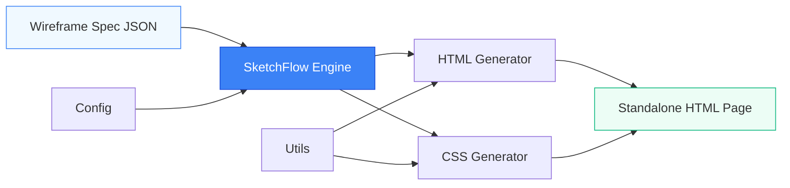
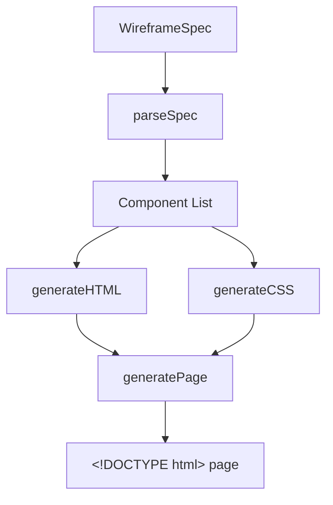

# SketchFlow

[](https://github.com/officethree/sketchflow/actions/workflows/ci.yml)
[](LICENSE)
[](https://nodejs.org/)
[](https://www.typescriptlang.org/)

**Wireframe-to-code converter** — generate production-ready HTML & CSS from structured wireframe descriptions.

Inspired by design-to-code AI trends.

---

## Architecture



### Component Pipeline



## Quickstart

### Install

```bash
git clone https://github.com/officethree/sketchflow.git
cd sketchflow
npm install
```

### Build & Run

```bash
# Build
npm run build

# Run the demo (outputs HTML to stdout)
npm start

# Generate a demo page
make demo
```

### Use as a Library

```typescript
import { SketchFlow, WireframeSpec } from "sketchflow";

const spec: WireframeSpec = {
  title: "My Landing Page",
  components: [
    { id: "h1", type: "header", props: { text: "Welcome" } },
    {
      id: "hero1",
      type: "hero",
      props: {
        text: "Build faster",
        subtitle: "From wireframe to code in seconds.",
      },
    },
    {
      id: "grid1",
      type: "grid",
      props: {
        columns: 3,
        children: [
          { id: "c1", type: "card", props: { text: "Fast" } },
          { id: "c2", type: "card", props: { text: "Flexible" } },
          { id: "c3", type: "card", props: { text: "Themeable" } },
        ],
      },
    },
    { id: "f1", type: "footer", props: { text: "© 2026" } },
  ],
};

const sf = new SketchFlow({ primaryColor: "#6366f1" });
const html = sf.generatePage(spec);
console.log(html);
```

### Run Tests

```bash
npm test
```

## Supported Components

| Component | Description                     |
|-----------|---------------------------------|
| `header`  | Page header with heading        |
| `nav`     | Navigation bar with links       |
| `hero`    | Hero section with title & copy  |
| `card`    | Content card with title & body  |
| `form`    | Input form with labeled fields  |
| `footer`  | Page footer                     |
| `grid`    | CSS Grid layout container       |
| `button`  | Styled button (3 variants)      |

## Configuration

Copy `.env.example` to `.env` and customise:

| Variable                     | Default                         |
|------------------------------|---------------------------------|
| `SKETCHFLOW_OUTPUT_DIR`      | `./output`                      |
| `SKETCHFLOW_THEME`           | `light`                         |
| `SKETCHFLOW_MINIFY`          | `false`                         |
| `SKETCHFLOW_FONT_FAMILY`     | `Inter, system-ui, sans-serif`  |
| `SKETCHFLOW_PRIMARY_COLOR`   | `#3b82f6`                       |
| `SKETCHFLOW_RESPONSIVE`      | `true`                          |

Or pass overrides programmatically:

```typescript
const sf = new SketchFlow({
  primaryColor: "#ef4444",
  fontFamily: "Roboto, sans-serif",
  responsive: true,
});
```

## Project Structure

```
src/
  index.ts     — Public API & CLI entry point
  core.ts      — SketchFlow engine & component renderers
  config.ts    — Configuration management
  utils.ts     — HTML, CSS, and color utilities
tests/
  core.test.ts — Unit tests
docs/
  ARCHITECTURE.md — Technical design document
```

## License

MIT — see [LICENSE](LICENSE) for details.

---

Built by **Officethree Technologies** | Made with ❤️ and AI
